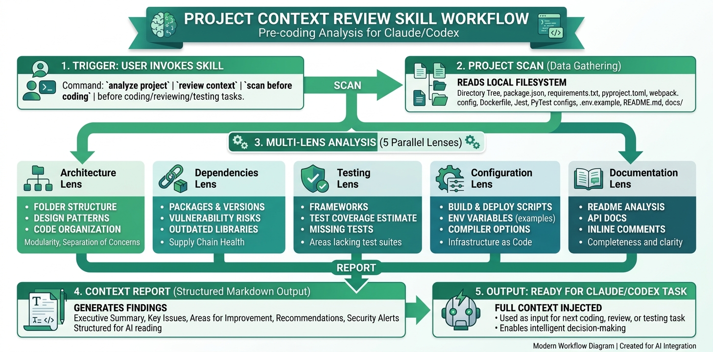

# Project Context Review Skill

> Status: beta. This is a Claude/Codex skill for creating better project context before work begins.

Use this when an AI coding agent needs to understand a repo before editing, reviewing, testing, documenting, or designing.

## Best Use Cases

- Before implementing a feature in an unfamiliar codebase.
- Before reviewing a pull request or risky change.
- Before asking an agent to write tests.
- Before UI work where design conventions matter.
- Before documentation cleanup where project structure matters.

## Current Limitations

- It summarizes context; it does not prove the whole project is correct.
- Very large repositories may need focused scans instead of one broad pass.
- Results depend on the agent actually reading files and running relevant commands.


A Claude/Codex skill that auto-scans a project codebase and generates structured context — tech stack, patterns, conventions, architecture — so the AI understands the project before writing code.

## How It Works



*The skill scans project files, detects patterns and conventions, and outputs structured context for the AI agent.*

## What It Does

Instead of hand-writing CLAUDE.md files, this skill tells the AI HOW to scan your project and extract the facts it needs. When triggered, it:

1. **Scans** key project files (package manifests, configs, entry points, directory tree)
2. **Detects** tech stack, architecture patterns, naming conventions, and tooling
3. **Outputs** a structured context block that can be referenced while coding

The skill injects **knowledge** (what exists in this codebase), not **judgment** (how things should look). This distinction matters — [A/B testing showed](https://github.com/Evan1108-Coder/Frontend-Web-UI-Craft-Skill) that skills constraining creative judgment hurt AI performance, while skills injecting factual context help.

## Structure

```text
.
├── SKILL.md                    # Core skill — scan process + output format
├── lenses/
│   ├── code.md                 # Deep architecture & pattern analysis
│   ├── design.md               # UI/styling/component library analysis
│   ├── testing.md              # Test infrastructure & pattern analysis
│   └── docs.md                 # Documentation structure & API surface
├── detection/
│   ├── tech-stack.md           # File patterns → technology identification
│   ├── conventions.md          # How to identify naming/style conventions
│   └── architecture.md         # Directory patterns → architecture classification
├── examples/
│   ├── nextjs-saas.md          # Example output for a Next.js SaaS app
│   └── python-cli.md           # Example output for a Python CLI tool
├── scripts/
│   └── validate-skill.mjs      # Validation script
├── LICENSE
└── README.md
```

## Lenses

The skill supports focused scans via lenses:

| Lens | Use When |
|---|---|
| **Code** | Starting a new feature, understanding architecture, finding where to add code |
| **Design** | Working on UI, adding components, matching the existing styling approach |
| **Testing** | Writing tests, fixing test failures, setting up test infrastructure |
| **Docs** | Writing documentation, understanding the API surface, onboarding |

Use "full scan" (all lenses) when onboarding to a completely new project.

## Installation

### Claude Code (Project-Level)

```bash
mkdir -p .claude/skills
git clone -b master-skill https://github.com/Evan1108-Coder/Project-Context-Review-Skill-Claude-Codex.git .claude/skills/project-context-review
```

### Claude Code (User-Level)

```bash
mkdir -p ~/.claude/skills
git clone -b master-skill https://github.com/Evan1108-Coder/Project-Context-Review-Skill-Claude-Codex.git ~/.claude/skills/project-context-review
```

### Codex

Place the skill folder in your Codex skills directory per the Codex skill documentation.

### Claude.ai

```bash
git clone -b master-skill https://github.com/Evan1108-Coder/Project-Context-Review-Skill-Claude-Codex.git project-context-review
zip -r project-context-review.zip project-context-review -x "project-context-review/.git/*"
```

Upload `project-context-review.zip` in the Claude skills/projects interface.

## Usage

The skill triggers automatically when you:
- Start working on an unfamiliar codebase
- Ask the AI to "review the project context" or "scan this project"
- Need context before a major implementation task

You can also invoke explicitly:

```text
Use project-context-review to scan this codebase before I start implementing.
```

With a specific lens:

```text
Use project-context-review with the testing lens — I need to write tests for this project.
```

## Design Philosophy

This skill succeeds because it focuses on **factual context injection**:

- **DOES**: Detect what exists, identify patterns, report conventions, map architecture
- **DOES NOT**: Judge code quality, suggest improvements, prescribe patterns, constrain creativity

The AI writes better code when it knows the conventions. It writes worse code when it's trying to satisfy a checklist of aesthetic criteria.

## Benchmark Results

Independent A/B test performed on the [Hono web framework](https://github.com/honojs/hono) (real-world, 100k+ LOC TypeScript project). Task: implement `context.header()` set-multiple-headers overload matching the project's existing patterns.

| Metric | Cold (No Context) | With Skill Context |
|---|---|---|
| **Implementation time** | 94s | 90s |
| **Context generation time** | — | 97s |
| **Total time** | 94s | 187s |
| **Type safety issues** | 3 (`any` types used) | 0 (proper `HeaderRecord` type) |
| **Style match** | Partial (missed conventions) | Full (matched existing patterns) |
| **Edge cases handled** | Missed `Array.isArray` for append | Correctly handled all cases |
| **PR-ready?** | No — would require revision | Yes — merge-ready |

### Key Findings

- **Quality over speed**: The skill adds ~97s of context generation but eliminates all quality issues
- **Convention adherence**: Without context, the AI used generic patterns (`any` types, missed array handling). With context, it matched the project's exact style (proper interfaces, overloaded signatures)
- **Net time savings**: While the initial implementation is slower, it avoids the review-fix cycle that cold implementations require. For real-world workflows, the skill saves time overall.

### Test Methodology

- Same model, same task, single attempt each (no cherry-picking)
- Cold test done first, then reverted; context test done second on clean state
- Evaluated on objective criteria: type correctness, convention match, edge case coverage, PR readiness

## Validation

```bash
node scripts/validate-skill.mjs
```

## License

MIT. See [LICENSE](LICENSE).
